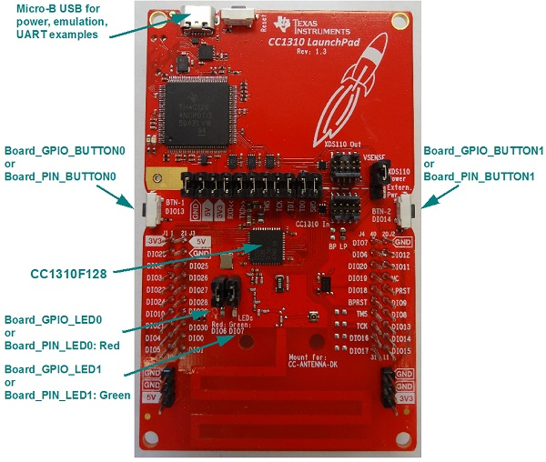

# CC1310 SimpleLink LaunchPad Settings & Resources

The CC1310 LaunchPad consists of a LaunchPad board with a CC1310F128 device.

## Jumper Settings

* For any examples that use LEDs, make sure the LED’s jumper settings are
closed.

## Board resources used in driver examples

The following table lists the Board names of the resources used by
the driver examples, and their corresponding pins.  Note that there may be
other resources configured in the board files that are not used by any
driver example.  Only the example resources are listed in the table.

  |Board Resource|Pin|
  |--------------|:---|
  |`Board_ADC0`|DIO23|
  |`Board_ADC1`|DIO24|
  |`Board_ADCBUF0CHANNEL0`|DIO23|
  |`Board_GPIO_BUTTON0`|DIO13|
  |`Board_GPIO_BUTTON1`|DIO14|
  |`Board_GPIO_LED0`|DIO6  (Red - must be jumpered)|
  |`Board_GPIO_LED1`|DIO7  (Green - must be jumpered)|
  |`Board_I2C_TMP`|DIO4 - `SCL`, DIO5 - `SDA`|
  |`Board_PIN_LED0`|DIO6  (Red - must be jumpered)|
  |`Board_PIN_LED1`|DIO7  (Green - must be jumpered)|
  |`Board_PIN_LED2`|DIO6  (Red - must be jumpered)|
  |`Board_PIN_BUTTON0`|DIO13|
  |`Board_PIN_BUTTON1`|DIO14|
  |`Board_PWM0`|DIO6|
  |`Board_PWM1`|DIO7|
  |`Board_SD0`|DIO8 - `MISO`, DIO9 - `MOSI`, DIO10 - `CLK`, DIO21 - `CS`|
  |`Board_SPI0`|DIO8 - `MISO`, DIO9 - `MOSI`, DIO10 - `CLK`|
  |`Board_SPI_MASTER`|DIO8 - `MISO`, DIO9 - `MOSI`, DIO10 - `CLK`|
  |`Board_SPI_SLAVE`|DIO8 - `MISO`, DIO9 - `MOSI`, DIO10 - `CLK`|
  |`Board_SPI_MASTER_READY`|DIO15|
  |`Board_SPI_SLAVE_READY`|DIO21|
  |`Board_UART0`|DIO2 - `RX`, DIO3 - `TX`|

## Booster packs

The following examples require booster packs.

  |Example|Booster Pack|
  |-------|:------------|
  |display|[430BOOST-SHARP96 LCD BoosterPack](http://www.ti.com/tool/430boost-sharp96)|
  |i2ctmp007|[BOOSTXL-SENSORS Sensors BoosterPack](http://www.ti.com/tool/boostxl-sensors)|
  |portable|[BOOSTXL-SENSORS Sensors BoosterPack](http://www.ti.com/tool/boostxl-sensors)|
  |sdraw|[microSD Card BoosterPack](http://boardzoo.com/index.php/boosterpacks/microsd-boosterpack.html#.WBjQnXr9xv4) or [SD Card BoosterPack](http://store.43oh.com/index.php?route=product/product&path=64&product_id=66)|

## Peripherals Used

The following list shows which CC1310 LaunchPad peripherals are used by driver and kernel applications. Driver examples control which peripherals (and which ports) are used.

* __TI-RTOS Kernel (SYS/BIOS).__ Uses the CC13xx’s RTC timer and that timer's associated interrupts. The TI-RTOS Kernel manages the Interrupt Vector Table.
* __Drivers.__
    * __ADC:__ A CC13xx/CC26xx specific driver that uses the onboard ADC peripheral.
    * __Crypto:__ A CC13xx/CC26xx specific driver that uses the onboard AES Crypto processor.
    * __GPIO:__ The GPIO driver is used in various examples to drive `BOARD_GPIO_LED0`, and to monitor the `BOARD_GPIO_BUTTON0` and `BOARD_GPIO_BUTTON1` buttons.
    * __I2C:__ The I2C driver is used to manage the`Board_I2C0` I2C instance.
    * __NVS:__ The `Board_NVSINTERNAL` region uses on-chip flash memory. This NVS region is defined in the example application's board file.
    * __NVS SPI:__ The `Board_NVSEXTERNAL` region uses off-chip SPI flash memory. This NVS region is defined in the example application's board file.
    * __PINs:__ A CC13xx/CC26xx specific PIN driver that uses 2 output pins for the onboard LEDs and 2 input pins for buttons `Board_PIN_BUTTON0` and `Board_PIN_BUTTON1`.
    * __RF:__ The RF driver uses the on-chip radio module on CC13xx devices.
    * __SD:__ The SD driver is built on the GPIO & SPI drivers to communicate with a SD card via SPI.  `Board_SD0` uses `Board_SPI0` to send data to-and-from the SD card.
    * __SPI:__ The SPI driver uses SPI0 for `Board_SPI0`.
    * __UART:__ The UART driver uses UART0, which is attached to the XDS110 USB emulator to facilitate serial communications.
    * __Watchdog.__ The Watchdog driver example uses the Watchdog Timer WDT peripheral (`Board_WATCHDOG0`).

